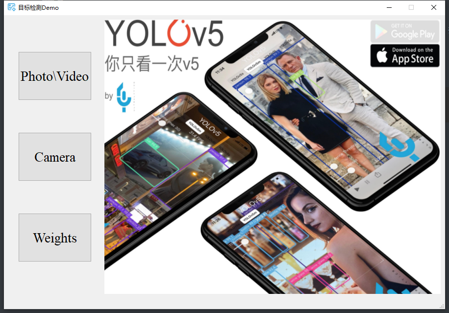

## **简介**

本项目使用pyqt5为yolov5-6.0开发了一个GUI界面，共实现了图片检测、视频检测、摄像头检测、选择权重四个功能，并将图片检测与视频检测合并为了同一个按钮。刚接触YOLO不久，代码很多地方写的不规范，仅供参考。

## **代码执行**

```
pip install -r requirements.txt
python window.py
```

运行window.py后出现的界面如下



## **参考与致谢**

[(10条消息) 当YOLOv5碰上PyQt5 ..._我的个人网站: https://xugaoxiang.com-CSDN博客](https://xugaoxiang.blog.csdn.net/article/details/118384430)

[手把手教你使用YOLOV5训练自己的目标检测模型_哔哩哔哩_bilibili](https://www.bilibili.com/video/BV1YL4y1J7xz)

感谢以上两位博文/视频的作者为本代码提供的思路。